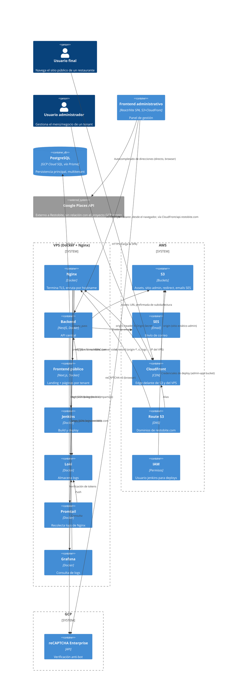

# Mapa de componentes

Vista de contenedores (nivel C4 "Container"). Sin rutas ni contratos — solo bloques y relaciones de tráfico/dependencia.

`Google Places API` se muestra como sistema externo (no es un componente de Restobite): representa la llamada directa del navegador (Frontend administrativo) a esa API, sin pasar por el backend.

## Componentes

- **Frontend público (Next.js)** — sirve el sitio por tenant (ruta `/-/{tenantCode}`) y la landing de Restobite; llama al backend solo desde el servidor (SSR/server actions), nunca desde el navegador.
- **Frontend administrativo (React/Vite)** — panel de gestión; SPA estática servida por S3+CloudFront; llama al backend directo desde el navegador y requiere login.
- **Backend (NestJS)** — API central; habla con PostgreSQL (vía Prisma), S3, SES, reCAPTCHA Enterprise, y emite logs. No se encontró integración con Google Places en el backend (ver [integraciones-externas.md](infraestructura/integraciones-externas.md)).
- **Base de datos (PostgreSQL / Prisma / multitenancy)** — persistencia principal, alojada en GCP Cloud SQL.
- **VPS (Docker + Nginx)** — corre efectivamente el backend, el frontend público, Jenkins y el stack de logs; Nginx termina TLS y enruta tráfico por hostname.
- **AWS (S3, SES, CloudFront, Route 53, IAM)** — assets y sitio admin (S3), correo (SES), CDN/edge (CloudFront), DNS (Route 53), credenciales de deploy (IAM).
- **GCP (Cloud SQL, reCAPTCHA Enterprise)** — base de datos productiva y verificación anti-bot. No se encontró uso de GCP como base paralela/alternativa a AWS: es la única base de datos relacional del sistema.
- **Observabilidad (Winston → Loki, y Nginx → Promtail → Loki → Grafana)** — dos rutas de ingesta distintas hacia el mismo Loki.
- **CI/CD (Jenkins + VPS)** — build y deploy; gran parte de su configuración vive fuera de Git (ver [cicd.md](infraestructura/cicd.md)).
